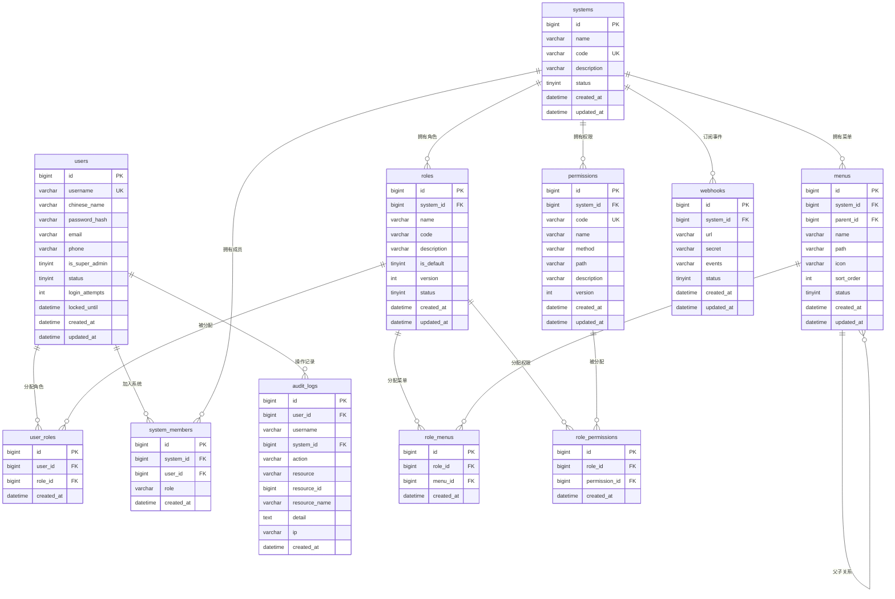

# GRBAC - 统一权限管理系统

基于RBAC模型的统一权限管理系统，支持多系统接入，通过角色控制用户的菜单权限和API接口权限。

## 技术栈

| 层 | 技术 |
|---|------|
| 后端 | Go + Gin + GORM |
| 前端 | Vue 3 + TypeScript + Element Plus + Pinia |
| 数据库 | MySQL 8.0 |
| 部署 | Docker + docker-compose |

## 项目结构

```
grbac/
├── backend/                    # Go后端
│   ├── cmd/server/main.go      # 程序入口
│   ├── internal/
│   │   ├── config/             # 配置加载
│   │   ├── database/           # MySQL/Redis连接
│   │   ├── handler/            # HTTP处理器
│   │   ├── middleware/         # 认证、权限、CORS中间件
│   │   ├── model/              # 数据模型
│   │   ├── pkg/                # 公共工具（errors, response, jwt, crypto）
│   │   ├── repository/         # 数据访问层
│   │   ├── router/             # 路由配置
│   │   └── service/            # 业务逻辑层
│   ├── migrations/             # SQL迁移脚本
│   ├── config/config.yaml      # 配置文件
│   └── Dockerfile
├── frontend/                   # Vue前端
│   ├── src/
│   │   ├── api/                # API请求封装
│   │   ├── layouts/            # 布局组件
│   │   ├── router/             # 路由配置
│   │   ├── stores/             # Pinia状态管理
│   │   ├── utils/              # 工具函数
│   │   └── views/              # 页面组件
│   └── Dockerfile
├── docker-compose.yaml
└── docs/                       # 设计文档
```

## 快速启动

### Docker部署（推荐）

```bash
# 克隆项目
git clone <repo-url>
cd grbac

# 启动所有服务
docker-compose up -d

# 访问
# 前端: http://localhost
# 后端API: http://localhost:8080
# 健康检查: http://localhost:8080/api/health
```

### 本地开发

**后端：**
```bash
cd backend

# 安装依赖
go mod tidy

# 配置数据库（修改 config/config.yaml）
# 运行迁移
go run ./cmd/server/main.go migrate

# 启动
go run ./cmd/server
```

**前端：**
```bash
cd frontend

# 安装依赖
npm install

# 开发模式
npm run dev

# 构建
npm run build
```

## 认证方式

| 场景 | 认证方式 |
|------|----------|
| 用户登录Web端 | JWT Token（有效期2小时） |
| 外部系统调用API | 固定凭证（X-System-Code + X-System-Secret） |

## API接口

### 认证

| 方法 | 路径 | 说明 | 认证 |
|------|------|------|------|
| POST | /api/auth/login | 用户登录 | 否 |
| POST | /api/auth/refresh | 刷新Token | 否 |
| POST | /api/auth/logout | 登出 | 是 |
| POST | /api/auth/change-password | 修改密码 | 是 |

### 用户管理（超级管理员）

| 方法 | 路径 | 说明 |
|------|------|------|
| GET | /api/users | 用户列表 |
| POST | /api/users | 创建用户 |
| PUT | /api/users/:id | 更新用户 |
| DELETE | /api/users/:id | 删除用户 |
| PUT | /api/users/:id/status | 启用/禁用用户 |

### 系统管理（超级管理员）

| 方法 | 路径 | 说明 |
|------|------|------|
| GET | /api/systems | 系统列表 |
| POST | /api/systems | 注册系统 |
| PUT | /api/systems/:id | 更新系统 |
| DELETE | /api/systems/:id | 删除系统 |
| GET | /api/systems/:id/members | 成员列表 |
| POST | /api/systems/:id/members | 添加成员 |
| DELETE | /api/systems/:id/members/:uid | 移除成员 |

### 角色管理（系统管理员）

| 方法 | 路径 | 说明 |
|------|------|------|
| GET | /api/systems/:sid/roles | 角色列表 |
| POST | /api/systems/:sid/roles | 创建角色 |
| PUT | /api/systems/:sid/roles/:id | 更新角色 |
| DELETE | /api/systems/:sid/roles/:id | 删除角色 |
| POST | /api/systems/:sid/roles/:id/menus | 分配菜单 |
| POST | /api/systems/:sid/roles/:id/permissions | 分配权限 |
| POST | /api/systems/:sid/roles/:id/users | 分配用户 |

### 菜单管理（系统管理员）

| 方法 | 路径 | 说明 |
|------|------|------|
| GET | /api/systems/:sid/menus | 菜单树 |
| POST | /api/systems/:sid/menus | 创建菜单 |
| PUT | /api/systems/:sid/menus/:id | 更新菜单 |
| DELETE | /api/systems/:sid/menus/:id | 删除菜单 |

### 权限管理（系统管理员）

| 方法 | 路径 | 说明 |
|------|------|------|
| GET | /api/systems/:sid/permissions | 权限列表 |
| POST | /api/systems/:sid/permissions | 创建权限 |
| PUT | /api/systems/:sid/permissions/:id | 更新权限 |
| DELETE | /api/systems/:sid/permissions/:id | 删除权限 |

### 外部系统接口

| 方法 | 路径 | 说明 |
|------|------|------|
| POST | /api/external/verify | 验证Token |
| GET | /api/external/userinfo | 获取用户信息 |
| GET | /api/external/menus | 获取用户菜单 |
| GET | /api/external/permissions | 获取用户权限 |
| GET | /api/external/validate | 校验权限 |

外部系统调用时需携带请求头：
```
X-System-Code: your_system_code
X-System-Secret: your_system_secret
X-User-Token: user_jwt_token
```

## 外部系统接入

```go
// 1. 注册系统，获取system_code和system_secret
// 2. 在RBAC中为系统创建菜单和权限
// 3. 创建角色并分配菜单/权限
// 4. 给用户分配角色
// 5. 用户登录获取Token后，携带Token调用外部系统
// 6. 外部系统调用RBAC验证权限
```

## 配置说明

配置文件：`backend/config/config.yaml`

```yaml
server:
  port: 8080          # 服务端口
  mode: debug         # debug/release

database:
  host: localhost
  port: 3306
  username: root
  password: ""
  dbname: grbac

redis:
  host: localhost
  port: 6379
  password: ""
  db: 0

jwt:
  secret: "your-secret-key"
  access_expire: 7200      # Token有效期（秒）
  refresh_expire: 604800   # 刷新Token有效期（秒）

password:
  min_length: 8       # 密码最小长度
  max_attempts: 5     # 登录失败锁定次数
  lock_duration: 1800 # 锁定时长（秒）
```

## ER 图



- 每个系统独立管理自己的菜单、权限、角色
- 用户可跨系统拥有不同角色
- 超级管理员管理所有系统和用户
- 系统管理员管理自己系统的配置
- 菜单通过 `parent_id` 自引用实现树形结构

## License

MIT
